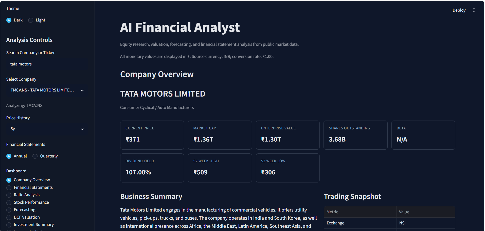
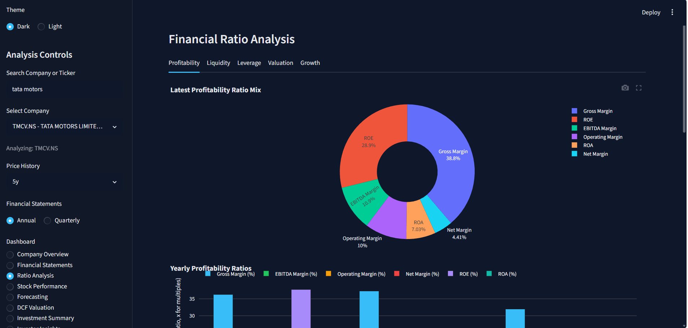
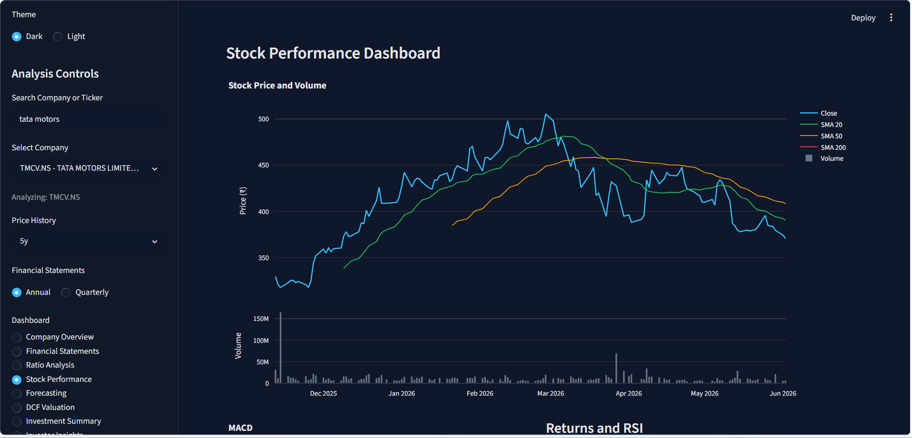
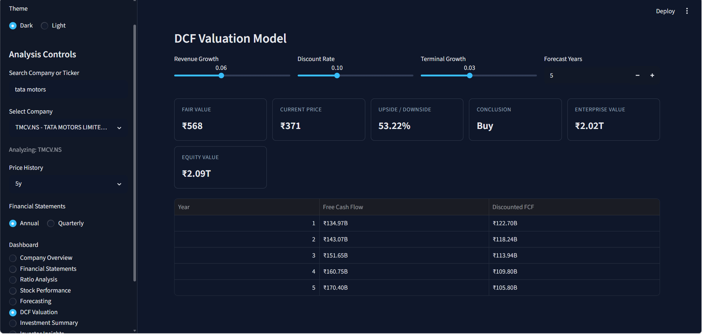
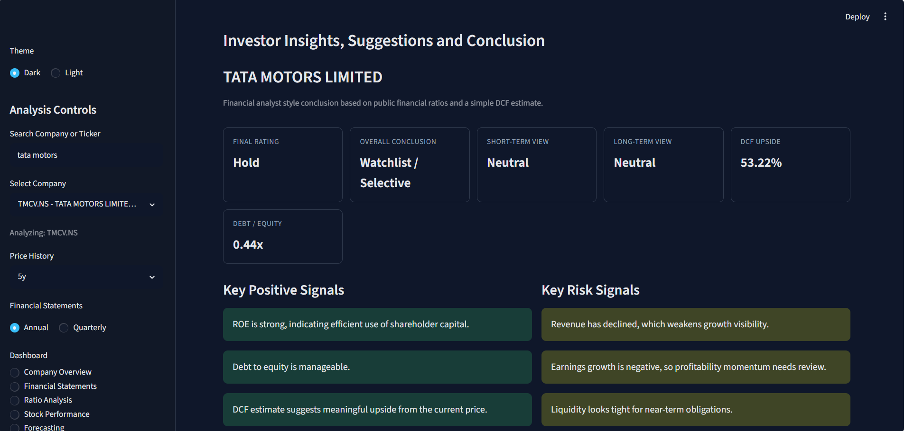

# AI Financial Analyst Platform

An interactive Streamlit web application for public-company research, financial statement analysis, financial ratio analysis, stock performance tracking, price forecasting, DCF valuation, and investor-focused insights.

The goal of this project is to help users convert raw public market data into clear dashboards and financial analyst-style conclusions for short-term and long-term investment research.

> Disclaimer: This project is for educational and research purposes only. It is not financial advice.

## 🎬 Project Demo

[AI Financial Analyst Demo](ChatGPT Image Jun 2, 2026, 06_46_28 PM)](https://youtu.be/XvNjxwL2T4M?si=eNE3AaTX6sUwhjk6)
## Screenshots

Add your app screenshots inside `assets/screenshots/` using the same file names below.

### Company Overview



### Ratio Analysis



### Stock Performance Dashboard



### DCF Valuation



### Investor Insights



## Features

- Search public companies by company name or Twelve Data symbol
- Select annual or quarterly financial statements
- View company overview, business summary, sector, industry, and market KPIs
- Analyze income statement, balance sheet, and cash flow statement
- Calculate profitability, liquidity, leverage, valuation, and growth ratios
- Display latest ratio mix charts and yearly ratio bar charts
- Analyze stock price, volume, moving averages, RSI, and MACD
- Generate 30-day and 90-day stock price forecasts using linear regression
- Estimate intrinsic value using a DCF valuation model
- Compare current market price with estimated fair value
- Generate automated investment summary
- Provide investor insights for short-term and long-term investment views
- Highlight key positive signals and key risk signals
- Handle invalid tickers, API issues, and missing financial data gracefully

## Dashboards

### 1. Company Overview

Shows a quick business and market snapshot of the selected company.

It includes:

- Company name and ticker
- Sector and industry
- Business summary
- Market capitalization
- Current price
- 52-week high and low
- Beta
- Dividend yield
- P/E ratio

### 2. Financial Statements

Displays financial statement data from Twelve Data.

Supported statements:

- Income statement
- Balance sheet
- Cash flow statement

Users can switch between:

- Annual statements
- Quarterly statements

### 3. Ratio Analysis

Calculates and visualizes important financial ratios.

Ratio categories:

- Profitability: Gross Margin, EBITDA Margin, Operating Margin, Net Margin, ROE, ROA
- Liquidity: Current Ratio, Quick Ratio
- Leverage: Debt-to-Equity, Debt Ratio
- Valuation: P/E, P/B, EV/EBITDA, PEG Ratio
- Growth: Revenue Growth, Earnings Growth

Visualizations include:

- Latest ratio mix chart
- Year-wise grouped bar chart
- Formatted ratio table

### 4. Stock Performance

Analyzes historical price and volume movement.

Includes:

- Closing price chart
- Volume chart
- 20-day, 50-day, and 200-day moving averages
- Daily returns
- RSI
- MACD and MACD signal

### 5. Forecasting

Uses a simple machine learning model to forecast future stock prices.

Includes:

- 30-day forecast
- 90-day forecast
- Historical price comparison
- Forecast trend visualization

The forecasting model uses linear regression and is intended only as an educational estimate.

### 6. DCF Valuation

Estimates intrinsic value using a discounted cash flow model.

User-controlled assumptions include:

- Growth rate
- Discount rate
- Terminal growth rate
- Forecast period

Outputs include:

- Estimated intrinsic value
- Current market price
- Upside or downside
- Buy, Hold, or Sell conclusion

### 7. Investment Summary

Provides a quick automated investment summary using selected financial indicators.

It considers:

- Revenue growth
- Net margin
- Debt-to-equity
- DCF upside or downside

### 8. Investor Insights

Provides a financial analyst-style recommendation for investors.

It includes:

- Final rating
- Overall conclusion
- Short-term investment view
- Long-term investment view
- Key positive signals
- Key risk signals
- Suggestions for investors
- Final analyst conclusion

### 9. Investor Dashboard

Provides an executive-style investor view.

It includes:

- Financial health gauge
- Current price vs DCF fair value
- Investor driver scorecard
- Risk and health mix
- Plain-language investor explanation

## Tech Stack

- Python: Main programming language
- Streamlit: Web application framework
- Pandas: Data processing and financial statement handling
- NumPy: Numerical calculations
- Twelve Data API: Public company, market, financial statement, and FX data source
- Plotly: Interactive charts and dashboards
- Scikit-learn: Linear regression forecasting
- Matplotlib: Charting support and environment compatibility
- OpenPyXL: Excel file support

## How It Works

1. User searches for a company name or stock ticker.
2. The app fetches company matches and ticker data from Twelve Data.
3. User selects the desired company.
4. The app loads company information, price history, and financial statements.
5. Financial ratios are calculated from income statement and balance sheet data.
6. Charts and tables are generated using Plotly and Streamlit.
7. Technical indicators are added to historical stock prices.
8. Linear regression is used for educational price forecasting.
9. DCF valuation estimates the company fair value.
10. Investment summary and investor insights are generated from financial signals.

## Project Structure

```text
financial_ai_analyst/
|-- app.py
|   `-- Main Streamlit entry point, sidebar controls, data loading, and routing
|
|-- config.py
|   `-- App title, default values, chart template, and statement line items
|
|-- sitecustomize.py
|   `-- Matplotlib environment setup
|
|-- requirements.txt
|   `-- Python dependencies
|
|-- README.md
|   `-- Project documentation
|
|-- assets/
|   |-- screenshots/
|   |   |-- company-overview.png
|   |   |-- ratio-analysis.png
|   |   |-- stock-performance.png
|   |   |-- dcf-valuation.png
|   |   `-- investor-insights.png
|
|-- data/
|   `-- Local generated/cache-related data
|
|-- models/
|   `-- Reserved for future saved ML models
|
|-- pages/
|   |-- company_overview.py
|   |-- financial_statements.py
|   |-- forecasting_dashboard.py
|   |-- investment_summary.py
|   |-- investor_dashboard.py
|   |-- investor_insights.py
|   |-- ratio_analysis.py
|   `-- valuation_dashboard.py
|
`-- utils/
    |-- charts.py
    |-- fetch_data.py
    |-- financial_ratios.py
    |-- forecasting.py
    |-- helpers.py
    `-- valuation.py
```

## Installation

Clone the repository:

```bash
git clone https://github.com/your-username/financial_ai_analyst.git
cd financial_ai_analyst
```

Create and activate a virtual environment:

```bash
python -m venv venv
```

For Windows:

```bash
venv\Scripts\activate
```

For macOS/Linux:

```bash
source venv/bin/activate
```

Install dependencies:

```bash
pip install -r requirements.txt
```

Set your Twelve Data API key:

```bash
set TWELVE_DATA_API_KEY=your_api_key_here
```

For Streamlit secrets, create `.streamlit/secrets.toml`:

```toml
TWELVE_DATA_API_KEY = "your_api_key_here"
```

Run the app:

```bash
streamlit run app.py
```

Open the app in your browser:

```text
http://localhost:8501
```

## How To Add Screenshots To README

1. Run the app:

```bash
streamlit run app.py
```

2. Open each dashboard page in your browser.
3. Take screenshots using `Win + Shift + S` on Windows.
4. Save the screenshots in this folder:

```text
assets/screenshots/
```

5. Use these exact file names:

```text
company-overview.png
ratio-analysis.png
stock-performance.png
dcf-valuation.png
investor-insights.png
```

GitHub will automatically display them in the README.

## Important Financial Metrics Used

- Gross Margin
- EBITDA Margin
- Operating Margin
- Net Margin
- Return on Equity
- Return on Assets
- Current Ratio
- Quick Ratio
- Debt-to-Equity Ratio
- Debt Ratio
- Revenue Growth
- Earnings Growth
- P/E Ratio
- P/B Ratio
- EV/EBITDA
- PEG Ratio
- DCF Upside/Downside

## Learning Outcomes

This project helped practice:

- Python application development
- Streamlit dashboard creation
- Financial statement analysis
- Financial ratio calculation
- Stock market data analysis
- Interactive data visualization
- Machine learning-based forecasting
- DCF valuation modeling
- Modular project organization
- Investor-focused reporting

## Data Source Note

The app uses Twelve Data for symbol search, profile, quotes, time series, financial statements, and currency exchange rates.

Twelve Data financial statement endpoints such as income statement, balance sheet, and cash flow are paid/pro-level fundamentals endpoints. If your API plan does not include fundamentals access, the price dashboards may work while financial statement, ratio, valuation, and investor insight sections may show missing-data warnings.

## Future Improvements

- Add peer comparison
- Add sector benchmark analysis
- Add export to PDF report
- Add downloadable Excel reports
- Add portfolio-level analysis
- Improve forecasting with advanced time-series models
- Add user authentication
- Deploy the app on Streamlit Community Cloud

## Disclaimer

This application uses public financial data and simplified models. The analysis, forecasts, ratings, and conclusions are for educational and research purposes only.

This project does not provide personalized investment advice. Always do your own research and consult a qualified financial advisor before making investment decisions.
